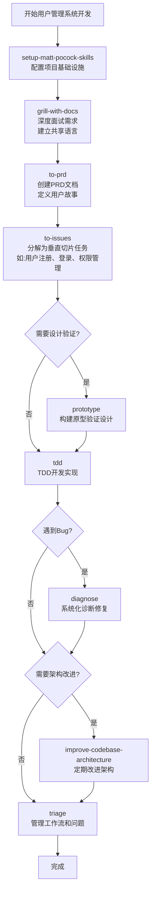

> 关于 mattpocock/skills 这个 skill，作为一名开发者，我该怎么使用上述这些技能，比如说，我要开发一个用户管理系统，按照上面提供的 skills，应该分别怎么使用 来完成这个 需求？

开发用户管理系统的完整工作流程如下：

## 完整开发流程

### 1. 项目初始化阶段
首先运行 `/setup-matt-pocock-skills` 来配置项目的基础设施 [1](#1-0) 。这个技能会设置：
- **问题追踪器**：选择 GitHub、GitLab 或本地 markdown 文件
- **Triage 标签**：配置问题分类的标签词汇
- **域文档布局**：确定 CONTEXT.md 和 ADRs 的存储位置 [2](#1-1) 

### 2. 需求分析阶段
使用 `/grill-with-docs` 对用户管理系统需求进行深度面试 [3](#1-2) 。这个阶段会：
- **挑战领域模型**：验证用户、角色、权限等概念的定义
- **精炼术语**：建立统一的术语（如"用户认证"vs"用户授权"）
- **更新文档**：将决策记录到 CONTEXT.md 和 ADRs 中 [4](#1-3) 

### 3. 规划阶段
#### 创建 PRD
运行 `/to-prd` 将讨论转化为正式的产品需求文档 [5](#1-4) 。PRD 包含：
- **问题陈述**：从用户角度描述问题
- **解决方案**：用户视角的解决方案
- **用户故事**：详细的功能需求列表
- **实现决策**：模块设计、接口定义、架构决策
- **测试决策**：测试策略和模块覆盖范围 [6](#1-5) 

#### 分解任务
使用 `/to-issues` 将 PRD 分解为垂直切片的任务 [7](#1-6) 。每个任务：
- **垂直切片**：贯穿所有集成层（数据库、API、UI、测试）
- **独立可抓取**：每个任务都可以独立完成和验证
- **分类标记**：HITL（需要人工干预）或 AFK（可自动完成） [8](#1-7) 

### 4. 设计验证阶段
如果对某些设计不确定，使用 `/prototype` 构建原型 [9](#1-8) ：
- **逻辑分支**：构建交互式终端应用来验证状态机（如用户登录状态流转）
- **UI 分支**：生成多个 UI 变体来探索设计选项（如用户注册表单布局） [10](#1-9) 

### 5. 实现阶段
使用 `/tdd` 进行测试驱动开发 [11](#1-10) ：
- **规划阶段**：确认接口变更、确定测试行为、识别深度模块
- **追踪子弹**：先写一个测试，实现最小代码通过
- **增量循环**：红-绿-重构循环，每次一个测试
- **重构阶段**：提取重复、深化模块、应用 SOLID 原则 [12](#1-11) 

### 6. 调试阶段
遇到 bug 时使用 `/diagnose` 进行系统化诊断 [13](#1-12) ：
- **重现**：复现问题
- **最小化**：简化问题场景
- **假设**：提出假设
- **工具化**：添加调试工具
- **修复**：实施修复
- **回归测试**：验证修复

### 7. 架构改进阶段
定期运行 `/improve-codebase-architecture` 来改进代码质量 [14](#1-13) ：
- **探索代码库**：识别浅模块和紧耦合
- **生成报告**：创建 HTML 报告显示改进机会
- **深度化模块**：将复杂性移到简单接口后面
- **更新文档**：将新术语添加到 CONTEXT.md [15](#1-14) 

### 8. 问题管理阶段
使用 `/triage` 管理问题工作流 [16](#1-15) ：
- **状态机**：needs-triage → needs-info → ready-for-agent → ready-for-human → wontfix
- **分类**：bug 或 enhancement
- **代理简报**：为 AFK 代理创建详细指令 [17](#1-16) 

## 用户管理系统具体应用示例



## Notes

- 所有工程技能都依赖于 `/setup-matt-pocock-skills` 的配置，特别是 `to-issues`、`to-prd`、`triage` 这些硬依赖技能 [18](#1-17) 
- `/grill-with-docs` 是整个流程的核心，它建立的共享语言会贯穿后续所有阶段 [19](#1-18) 
- 垂直切片方法论确保每个任务都能产生可演示的功能，而不是水平分层开发 [20](#1-19) 
- TDD 强调测试行为而非实现细节，这样重构时测试不会破坏 [21](#1-20) 

Wiki pages you might want to explore:
- [Glossary (mattpocock/skills)](/wiki/mattpocock/skills#10)
- [Product Planning Skills (mattpocock/skills)](/wiki/mattpocock/skills#3)
- [Development Workflow Skills (mattpocock/skills)](/wiki/mattpocock/skills#4)

### Citations

**File:** skills/engineering/setup-matt-pocock-skills/SKILL.md (L1-4)
```markdown
---
name: setup-matt-pocock-skills
description: Sets up an `## Agent skills` block in AGENTS.md/CLAUDE.md and `docs/agents/` so the engineering skills know this repo's issue tracker (GitHub or local markdown), triage label vocabulary, and domain doc layout. Run before first use of `to-issues`, `to-prd`, `triage`, `diagnose`, `tdd`, `improve-codebase-architecture`, or `zoom-out` — or if those skills appear to be missing context about the issue tracker, triage labels, or domain docs.
disable-model-invocation: true
```

**File:** skills/engineering/setup-matt-pocock-skills/SKILL.md (L9-14)
```markdown
Scaffold the per-repo configuration that the engineering skills assume:

- **Issue tracker** — where issues live (GitHub by default; local markdown is also supported out of the box)
- **Triage labels** — the strings used for the five canonical triage roles
- **Domain docs** — where `CONTEXT.md` and ADRs live, and the consumer rules for reading them

```

**File:** skills/engineering/grill-with-docs/SKILL.md (L1-4)
```markdown
---
name: grill-with-docs
description: Grilling session that challenges your plan against the existing domain model, sharpens terminology, and updates documentation (CONTEXT.md, ADRs) inline as decisions crystallise. Use when user wants to stress-test a plan against their project's language and documented decisions.
---
```

**File:** skills/engineering/grill-with-docs/SKILL.md (L72-77)
```markdown
### Update CONTEXT.md inline

When a term is resolved, update `CONTEXT.md` right there. Don't batch these up — capture them as they happen. Use the format in [CONTEXT-FORMAT.md](./CONTEXT-FORMAT.md).

`CONTEXT.md` should be totally devoid of implementation details. Do not treat `CONTEXT.md` as a spec, a scratch pad, or a repository for implementation decisions. It is a glossary and nothing else.

```

**File:** skills/engineering/to-prd/SKILL.md (L1-4)
```markdown
---
name: to-prd
description: Turn the current conversation context into a PRD and publish it to the project issue tracker. Use when user wants to create a PRD from the current context.
---
```

**File:** skills/engineering/to-prd/SKILL.md (L22-76)
```markdown
<prd-template>

## Problem Statement

The problem that the user is facing, from the user's perspective.

## Solution

The solution to the problem, from the user's perspective.

## User Stories

A LONG, numbered list of user stories. Each user story should be in the format of:

1. As an <actor>, I want a <feature>, so that <benefit>

<user-story-example>
1. As a mobile bank customer, I want to see balance on my accounts, so that I can make better informed decisions about my spending
</user-story-example>

This list of user stories should be extremely extensive and cover all aspects of the feature.

## Implementation Decisions

A list of implementation decisions that were made. This can include:

- The modules that will be built/modified
- The interfaces of those modules that will be modified
- Technical clarifications from the developer
- Architectural decisions
- Schema changes
- API contracts
- Specific interactions

Do NOT include specific file paths or code snippets. They may end up being outdated very quickly.

Exception: if a prototype produced a snippet that encodes a decision more precisely than prose can (state machine, reducer, schema, type shape), inline it within the relevant decision and note briefly that it came from a prototype. Trim to the decision-rich parts — not a working demo, just the important bits.

## Testing Decisions

A list of testing decisions that were made. Include:

- A description of what makes a good test (only test external behavior, not implementation details)
- Which modules will be tested
- Prior art for the tests (i.e. similar types of tests in the codebase)

## Out of Scope

A description of the things that are out of scope for this PRD.

## Further Notes

Any further notes about the feature.

</prd-template>
```

**File:** skills/engineering/to-issues/SKILL.md (L1-4)
```markdown
---
name: to-issues
description: Break a plan, spec, or PRD into independently-grabbable issues on the project issue tracker using tracer-bullet vertical slices. Use when user wants to convert a plan into issues, create implementation tickets, or break down work into issues.
---
```

**File:** skills/engineering/to-issues/SKILL.md (L22-32)
```markdown
### 3. Draft vertical slices

Break the plan into **tracer bullet** issues. Each issue is a thin vertical slice that cuts through ALL integration layers end-to-end, NOT a horizontal slice of one layer.

Slices may be 'HITL' or 'AFK'. HITL slices require human interaction, such as an architectural decision or a design review. AFK slices can be implemented and merged without human interaction. Prefer AFK over HITL where possible.

<vertical-slice-rules>
- Each slice delivers a narrow but COMPLETE path through every layer (schema, API, UI, tests)
- A completed slice is demoable or verifiable on its own
- Prefer many thin slices over few thick ones
</vertical-slice-rules>
```

**File:** skills/engineering/prototype/SKILL.md (L1-4)
```markdown
---
name: prototype
description: Build a throwaway prototype to flesh out a design before committing to it. Routes between two branches — a runnable terminal app for state/business-logic questions, or several radically different UI variations toggleable from one route. Use when the user wants to prototype, sanity-check a data model or state machine, mock up a UI, explore design options, or says "prototype this", "let me play with it", "try a few designs".
---
```

**File:** skills/engineering/prototype/SKILL.md (L14-16)
```markdown
- **"Does this logic / state model feel right?"** → [LOGIC.md](LOGIC.md). Build a tiny interactive terminal app that pushes the state machine through cases that are hard to reason about on paper.
- **"What should this look like?"** → [UI.md](UI.md). Generate several radically different UI variations on a single route, switchable via a URL search param and a floating bottom bar.

```

**File:** skills/engineering/tdd/SKILL.md (L1-4)
```markdown
---
name: tdd
description: Test-driven development with red-green-refactor loop. Use when user wants to build features or fix bugs using TDD, mentions "red-green-refactor", wants integration tests, or asks for test-first development.
---
```

**File:** skills/engineering/tdd/SKILL.md (L10-16)
```markdown
**Core principle**: Tests should verify behavior through public interfaces, not implementation details. Code can change entirely; tests shouldn't.

**Good tests** are integration-style: they exercise real code paths through public APIs. They describe _what_ the system does, not _how_ it does it. A good test reads like a specification - "user can checkout with valid cart" tells you exactly what capability exists. These tests survive refactors because they don't care about internal structure.

**Bad tests** are coupled to implementation. They mock internal collaborators, test private methods, or verify through external means (like querying a database directly instead of using the interface). The warning sign: your test breaks when you refactor, but behavior hasn't changed. If you rename an internal function and tests fail, those tests were testing implementation, not behavior.

See [tests.md](tests.md) for examples and [mocking.md](mocking.md) for mocking guidelines.
```

**File:** skills/engineering/tdd/SKILL.md (L45-99)
```markdown
### 1. Planning

When exploring the codebase, use the project's domain glossary so that test names and interface vocabulary match the project's language, and respect ADRs in the area you're touching.

Before writing any code:

- [ ] Confirm with user what interface changes are needed
- [ ] Confirm with user which behaviors to test (prioritize)
- [ ] Identify opportunities for [deep modules](deep-modules.md) (small interface, deep implementation)
- [ ] Design interfaces for [testability](interface-design.md)
- [ ] List the behaviors to test (not implementation steps)
- [ ] Get user approval on the plan

Ask: "What should the public interface look like? Which behaviors are most important to test?"

**You can't test everything.** Confirm with the user exactly which behaviors matter most. Focus testing effort on critical paths and complex logic, not every possible edge case.

### 2. Tracer Bullet

Write ONE test that confirms ONE thing about the system:

```
RED:   Write test for first behavior → test fails
GREEN: Write minimal code to pass → test passes
```

This is your tracer bullet - proves the path works end-to-end.

### 3. Incremental Loop

For each remaining behavior:

```
RED:   Write next test → fails
GREEN: Minimal code to pass → passes
```

Rules:

- One test at a time
- Only enough code to pass current test
- Don't anticipate future tests
- Keep tests focused on observable behavior

### 4. Refactor

After all tests pass, look for [refactor candidates](refactoring.md):

- [ ] Extract duplication
- [ ] Deepen modules (move complexity behind simple interfaces)
- [ ] Apply SOLID principles where natural
- [ ] Consider what new code reveals about existing code
- [ ] Run tests after each refactor step

**Never refactor while RED.** Get to GREEN first.
```

**File:** skills/engineering/README.md (L5-6)
```markdown
- **[diagnose](./diagnose/SKILL.md)** — Disciplined diagnosis loop for hard bugs and performance regressions: reproduce → minimise → hypothesise → instrument → fix → regression-test.
- **[grill-with-docs](./grill-with-docs/SKILL.md)** — Grilling session that challenges your plan against the existing domain model, sharpens terminology, and updates `CONTEXT.md` and ADRs inline.
```

**File:** skills/engineering/README.md (L8-9)
```markdown
- **[improve-codebase-architecture](./improve-codebase-architecture/SKILL.md)** — Find deepening opportunities in a codebase, informed by the domain language in `CONTEXT.md` and the decisions in `docs/adr/`.
- **[setup-matt-pocock-skills](./setup-matt-pocock-skills/SKILL.md)** — Scaffold the per-repo config (issue tracker, triage label vocabulary, domain doc layout) that the other engineering skills consume.
```

**File:** skills/engineering/improve-codebase-architecture/SKILL.md (L33-81)
```markdown
### 1. Explore

Read the project's domain glossary and any ADRs in the area you're touching first.

Then use the Agent tool with `subagent_type=Explore` to walk the codebase. Don't follow rigid heuristics — explore organically and note where you experience friction:

- Where does understanding one concept require bouncing between many small modules?
- Where are modules **shallow** — interface nearly as complex as the implementation?
- Where have pure functions been extracted just for testability, but the real bugs hide in how they're called (no **locality**)?
- Where do tightly-coupled modules leak across their seams?
- Which parts of the codebase are untested, or hard to test through their current interface?

Apply the **deletion test** to anything you suspect is shallow: would deleting it concentrate complexity, or just move it? A "yes, concentrates" is the signal you want.

### 2. Present candidates as an HTML report

Write a self-contained HTML file to the OS temp directory so nothing lands in the repo. Resolve the temp dir from `$TMPDIR`, falling back to `/tmp` (or `%TEMP%` on Windows), and write to `<tmpdir>/architecture-review-<timestamp>.html` so each run gets a fresh file. Open it for the user — `xdg-open <path>` on Linux, `open <path>` on macOS, `start <path>` on Windows — and tell them the absolute path.

The report uses **Tailwind via CDN** for layout and styling, and **Mermaid via CDN** for diagrams where a graph/flow/sequence reliably communicates the structure. Mix Mermaid with hand-crafted CSS/SVG visuals — use Mermaid when relationships are graph-shaped (call graphs, dependencies, sequences), and hand-built divs/SVG when you want something more editorial (mass diagrams, cross-sections, collapse animations). Each candidate gets a **before/after visualisation**. Be visual.

For each candidate, the same template as before, but rendered as a card:

- **Files** — which files/modules are involved
- **Problem** — why the current architecture is causing friction
- **Solution** — plain English description of what would change
- **Benefits** — explained in terms of locality and leverage, and how tests would improve
- **Before / After diagram** — side-by-side, custom-drawn, illustrating the shallowness and the deepening
- **Recommendation strength** — one of `Strong`, `Worth exploring`, `Speculative`, rendered as a badge

End the report with a **Top recommendation** section: which candidate you'd tackle first and why.

**Use CONTEXT.md vocabulary for the domain, and [LANGUAGE.md](LANGUAGE.md) vocabulary for the architecture.** If `CONTEXT.md` defines "Order," talk about "the Order intake module" — not "the FooBarHandler," and not "the Order service."

**ADR conflicts**: if a candidate contradicts an existing ADR, only surface it when the friction is real enough to warrant revisiting the ADR. Mark it clearly in the card (e.g. a warning callout: _"contradicts ADR-0007 — but worth reopening because…"_). Don't list every theoretical refactor an ADR forbids.

See [HTML-REPORT.md](HTML-REPORT.md) for the full HTML scaffold, diagram patterns, and styling guidance.

Do NOT propose interfaces yet. After the file is written, ask the user: "Which of these would you like to explore?"

### 3. Grilling loop

Once the user picks a candidate, drop into a grilling conversation. Walk the design tree with them — constraints, dependencies, the shape of the deepened module, what sits behind the seam, what tests survive.

Side effects happen inline as decisions crystallize:

- **Naming a deepened module after a concept not in `CONTEXT.md`?** Add the term to `CONTEXT.md` — same discipline as `/grill-with-docs` (see [CONTEXT-FORMAT.md](../grill-with-docs/CONTEXT-FORMAT.md)). Create the file lazily if it doesn't exist.
- **Sharpening a fuzzy term during the conversation?** Update `CONTEXT.md` right there.
- **User rejects the candidate with a load-bearing reason?** Offer an ADR, framed as: _"Want me to record this as an ADR so future architecture reviews don't re-suggest it?"_ Only offer when the reason would actually be needed by a future explorer to avoid re-suggesting the same thing — skip ephemeral reasons ("not worth it right now") and self-evident ones. See [ADR-FORMAT.md](../grill-with-docs/ADR-FORMAT.md).
- **Want to explore alternative interfaces for the deepened module?** See [INTERFACE-DESIGN.md](INTERFACE-DESIGN.md).
```

**File:** skills/engineering/triage/SKILL.md (L1-4)
```markdown
---
name: triage
description: Triage issues through a state machine driven by triage roles. Use when user wants to create an issue, triage issues, review incoming bugs or feature requests, prepare issues for an AFK agent, or manage issue workflow.
---
```

**File:** skills/engineering/triage/SKILL.md (L21-41)
```markdown
## Roles

Two **category** roles:

- `bug` — something is broken
- `enhancement` — new feature or improvement

Five **state** roles:

- `needs-triage` — maintainer needs to evaluate
- `needs-info` — waiting on reporter for more information
- `ready-for-agent` — fully specified, ready for an AFK agent
- `ready-for-human` — needs human implementation
- `wontfix` — will not be actioned

Every triaged issue should carry exactly one category role and one state role. If state roles conflict, flag it and ask the maintainer before doing anything else.

These are canonical role names — the actual label strings used in the issue tracker may differ. The mapping should have been provided to you - run `/setup-matt-pocock-skills` if not.

State transitions: an unlabeled issue normally goes to `needs-triage` first; from there it moves to `needs-info`, `ready-for-agent`, `ready-for-human`, or `wontfix`. `needs-info` returns to `needs-triage` once the reporter replies. The maintainer can override at any time — flag transitions that look unusual and ask before proceeding.

```

**File:** docs/adr/0001-explicit-setup-pointer-only-for-hard-dependencies.md (L1-10)
```markdown
# Explicit `/setup-matt-pocock-skills` pointer only for hard dependencies

Engineering skills depend on per-repo config (issue tracker, triage label vocabulary, domain doc layout) seeded by `/setup-matt-pocock-skills`. Some skills cannot meaningfully function without that config — they have to publish to a specific issue tracker or apply a specific label string. Others only use it to sharpen output (vocabulary, ADR awareness) and degrade gracefully without it.

We split these into **hard-dependency** and **soft-dependency** skills:

- **Hard dependency** (`to-issues`, `to-prd`, `triage`) — include an explicit one-liner: _"… should have been provided to you — run `/setup-matt-pocock-skills` if not."_ Without the mapping, output is wrong, not just fuzzy.
- **Soft dependency** (`diagnose`, `tdd`, `improve-codebase-architecture`, `zoom-out`) — reference "the project's domain glossary" and "ADRs in the area you're touching" in vague prose only. If the docs aren't there, the skill still works; output is just less sharp.

The split keeps soft-dependency skills token-light and avoids cargo-culting the setup pointer into places where it isn't load-bearing.
```

**File:** README.md (L73-99)
```markdown
**The Fix** for this is a shared language. It's a document that helps agents decode the jargon used in the project.

<details>
<summary>
Example
</summary>

Here's an example [`CONTEXT.md`](https://github.com/mattpocock/course-video-manager/blob/076a5a7a182db0fe1e62971dd7a68bcadf010f1c/CONTEXT.md), from my `course-video-manager` repo. Which one is easier to read?

- **BEFORE**: "There's a problem when a lesson inside a section of a course is made 'real' (i.e. given a spot in the file system)"
- **AFTER**: "There's a problem with the materialization cascade"

This concision pays off session after session.

</details>

This is built into [`/grill-with-docs`](./skills/engineering/grill-with-docs/SKILL.md). It's a grilling session, but that helps you build a shared language with the AI, and document hard-to-explain decisions in ADR's.

It's hard to explain how powerful this is. It might be the single coolest technique in this repo. Try it, and see.

> [!TIP]
> A shared language has many other benefits than reducing verbosity:
>
> - **Variables, functions and files are named consistently**, using the shared language
> - As a result, the **codebase is easier to navigate** for the agent
> - The agent also **spends fewer tokens on thinking**, because it has access to a more concise language

```
